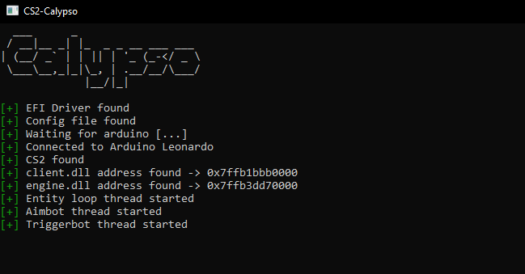

    
    <h3 align="center">Calypso</h3>
    
<i>CS2 EFI cheat with Arduino Support.</i>

## Setup
- Usb Drive
- [Optional]Arduino

(Any arduino that supports Mouse.h library)

## Features
#### Aimbot
- Customizable `fov`, `smooth` and `key`.
#### Triggerbot
- Customizable `delay` and `key`.
#### Config System
- Cheat uses self-sufficient config system. Dont have config file? Cheat will create it itself.
#### Arduino Support
- Cheat be used with or without Arduino.

## Default Key Binds

 **Aimbot**: `Left Click`
 
 **Triggerbot**: `Alt`

## Usage

Download Calypso from [Releases](https://github.com/3a1/CS2-Calypso/releases/latest) and follow these steps:

1. Download [UEFI-Shell](https://github.com/tianocore/edk2-archive/raw/master/ShellBinPkg/UefiShell/X64/Shell.efi) and rename from `Shell.efi` to `bootx64.efi`
   
2. Open downloaded Calypso, go to USB folder, create folders `EFI/Boot/` and paste renamed UEFI-Shell inside (`USB/EFI/Boot/bootx64.efi`)

3. Format USB drive to FAT32

4. Open `build.bat` inside Calypso folder

5. Copy all contents of the USB folder to your formated USB Drive

5. Boot from the USB drive

9. After that open `update_offsets.py` and start CalypsoUM.exe

Check out [USAGE.md](.github/docs/USAGE.md) for detailed instruction.

## Showcase & Usage
Click on image below to watch it on YouTube

## TODO
+ Add Raspberry Pi Pico W Support(?)
+ Add USB Host Shield support
+ Get module base address via EFI not usermode(?)
+ Add fullscreen esp(?)
+ Clean code and fix bugs
+ Auto-update offsets

## Credits
+ [EFI Driver](https://github.com/TheCruZ/EFI_Driver_Access)
+ [Arduino Code](https://github.com/backpack-0x1337/CyberAim-Valorant/)
+ [EFI VS Compile](https://github.com/pbatard/uefi-simple)
