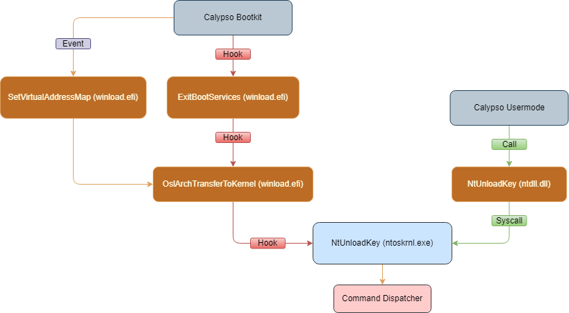

    
    <h3 align="center">Calypso</h3>
    
A lightweight UEFI Bootkit with user-mode communication

### General
- Written in C++ and assembly
- Compiled binary is just 7 KB in size
- Usermode communication 
- KPP Safe (Kernel Patch Guard)
- EDK2 library reduced to minimal (only the necessary)

## Features

- Read/Write Kernel Memory 
- Read/Write Process Memory (MMU translation)  
- Kill Protected Process
- Process Privilege Escalation (LPE)  

You can probably build any feature you want since you can directly call any exported function from `ntoskrnl.exe`.
The bootkit is designed to work on `Windows 10 22H2`. However, the offsets are hardcoded, so to make it work on other versions, you’ll need to update the offsets accordingly.

## Workflow

#### UefiMain
In `UefiMain`, the bootkit perfoms two main tasks. 
One is to save original `ExitBootServices` address to restore it later and place an `ExitBootServices` hook to redirect calls to `ExitBootServicesWrapper`.
Second is to create a `SetVirtualAddressMap` event which we will explain later why it is needed. 

#### ExitBootServices Wrapper (asm)
In `ExitBootServicesWrapper` the goal is to retrieve the return address from the `RSP` register.
Once the return address is obtained, execution is passed to the `ExitBootServicesHook`.
This is why we can't use the `ExitBootServices` event - in an event we cannot access the return address.

#### ExitBootServices Hook
In `ExitBootServicesHook` the goal is to locate `winload.efi` base. Since `ExitBootServices` is called from `winload.efi`,
and we have its return address, we know it points to a location somewhere inside `winload.efi`.
Executable images are always loaded at the start of a memory page (0x1000), so the base address will always end with three zeros.
Additionally, all executable images have a DOS header at the beggining, which starts with a specific magic value.
With this knowledge, we can iterate backward through memory, page by page, reading the first bytes of each page and
checking for the DOS magic value to identify the base address.

The next step is to locate the `OslArchTransferToKernel` address. 
Why do we need `OslArchTransferToKernel`? This function is called when `winload.efi` exits, and it passes
the `LoaderBlock` address. In the `LoaderBlock` structure, we can find the `LoadOrderListHead` list,
which contains the address of `ntoskrnl.exe`. To avhieve this, we use a simple pattern scan to identify the 
`OslArchTransferToKernel` address and hook it.

#### SetVirtualAddressMap Event
Remember the event we created in `UefiMain`? Now is the time for it to start.
The purpose of this event is to convert address of our function hook from physical to virtual.
Up to this point, the system operates only in physical memory without virtual address space.
I'll provide more details in the next stage.

#### OslArchTransferToKernel Hook
At this point, we have the `LoaderBlock` address, and we traverse the `LIST_ENTRY` structure to locate the `ntoskrnl.exe` base.
Once we have the `ntoskrnl.exe` base, the next step is to decide which function in the OS kernel to hook.

I choose the `NtUnloadKey` function for couple of reasons.

First, we need to keep in mind that we aim to establish communication between user-mode and the UEFI driver.
For this purpose, our kernel function needs to be executed as a syscall from the `ntdll.dll` user-mode library.

As I mentioned, i chose this function for several reasons, with the second and primary one that it is just wrapper for `CmUnloadKey` function.
What does this means? 
As you might know, Windows has a security feature called `Kernel Patch Guard` (KPP).
The purpose of KPP is to scan kernel memory for changes and trigger a blue screen if any are detected.
We bypass this feature by patching the OS kernel before it gets executed, so PatchGuard compares the already
patched `ntosrknl` with the one in memory for any changes (believing that the patched one is the correct version).
However, the problem that when hooking a function with a trampoline, the hooked function first jumps to the hook, performs
its work, restores the modified bytes, calls the original function again and then re-applies the trampoline jump before returning.
With KPP in place, we can't unhook the function because modifying the OS kernel at runtime would trigger KPP.

Here's where it gets complicated, we can't directly call the original function. Instead, we need to find a way to replace
the functionality of the original function. A function that acts as a wrapper to another function is ideal in this case.
By calling this wrapper function inside our kernel hook, it will effectively replace the original function's functionality. 
Of course, we could just hook it without saving the original functionallity, but if function is important and called by the OS,
we need to ensure it still performs as expected.

The next stage in this hook is to locate the function that calls `NtUnloadKey` and its original call to `CmUnloadKey`.
Once we have identified this, we proceed by hooking `NtUnloadKey`.

Here's the tricky part, we can't directly hook it here because we're are dealing with physical memory addresses.
Our local `NtUnloadKeyHook` address is physical, and when the system completes the boot process, it will translate to virtual
addresses, making that our hook won't work. This is where `SetVirtualAddressMap` event comes in. Inside it, we can translate
out local function hook into a virtual memory address, ensuring that the hook will work after OS will translate into virtual memory space.

#### NtUnloadKey Hook
In this function we simply check if the passed parameter is our command structure, if it's not, we return to `CmUnloadKey`,
mimicking the behavior of the original function. If it is our command, we pass the execution to the `dispatcher`. 

#### Usermode 
As we remember, the `NtUnloadKey` function from `ntdll.dll` is a syscall to the `NtUnloadKey` inside `ntoskrnl.exe`. 
So, Usermode can interact with our `NtUnloadKey` hook placed inside `ntoskrnl.exe` by calling the `NtUnloadKey` from `ntdll.dll`.
Overall in usermode is nothing fancy, usermode is very simple and gets its job done.

## Usage

You can check usage on [Youtube](https://www.youtube.com/watch?v=e9MB8HywIrw).

## Credits

This project is inspired by and builds upon the following repositories:  
- [bootkit-simple](https://github.com/malware-analysis-cheatsheets/bootkit-simple)  
- [rainbow](https://github.com/SamuelTulach/rainbow/)  
- [Banshee](https://github.com/eversinc33/Banshee/)  
